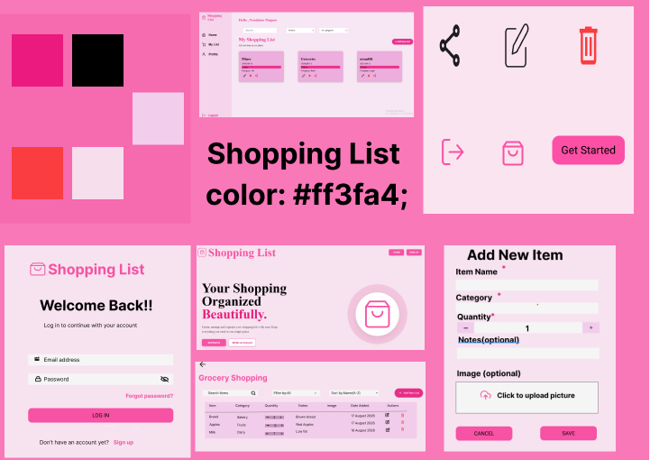

# SHOPPING-LIST

# Project picture


# Moodboard



# Project Description

```The Shopping List App is a web application that allows users to create and manage their personal shopping lists. Users can register and log in to their accounts, create shopping lists, add items to their lists, and manage those items.The application allows users to add, edit, and delete shopping items while keeping each user's shopping lists and items separate from other users. Users can also manage their profile information and login details.The project was built to demonstrate the use of React, TypeScript, Redux Toolkit, and JSON Server to create a responsive application with centralized state management and CRUD functionality.```


# Pseudocode

## Application Flow

```
START

Display Landing Page

IF user selects Sign Up

    Display Sign Up Page

    User enters registration details

    Validate registration details

    IF details are valid

        Hash password

        Save user to JSON Server

        Navigate to Login Page

    ELSE

        Display validation errors

    END IF

END IF


IF user selects Login

    Display Login Page

    User enters email and password

    Validate login details

    IF credentials are correct

        Save logged-in user

        Navigate to Home Page

    ELSE

        Display login error

    END IF

END IF


IF user is logged in

    Display Home Page

    Fetch user's shopping lists

    Display shopping lists

    IF user creates a shopping list

        Open Add List popup

        Enter list information

        Validate information

        Save list to JSON Server

        Update Redux state

    END IF


    IF user selects a shopping list

        Get shopping list ID

        Navigate to Shopping List Page

        Fetch items using list ID

        Display shopping items

    END IF


    IF user searches

        Search shopping lists or items

        Display matching results

    END IF


    IF user filters

        Filter shopping lists or items

        Display filtered results

    END IF


    IF user sorts

        Sort shopping lists or items

        Display sorted results

    END IF

END IF


IF user opens Profile

    Display profile information

    IF user edits profile

        Validate new information

        Update JSON Server

        Update Redux state

    END IF

END IF


IF user logs out

    Clear logged-in user

    Clear relevant Redux state

    Navigate to Landing Page

END IF

END
```

## Shopping List Pseudocode

```
START

Get logged-in user

Fetch shopping lists using userId

Display shopping lists

IF user clicks Add List

    Open Add List popup

    User enters:
        name
        category
        notes

    Validate information

    IF information is valid

        Create shopping list

        Save list to JSON Server

        Update Redux state

        Close popup

    ELSE

        Display error

    END IF

END IF


IF user clicks Edit

    Open Edit List popup

    Display existing list information

    User updates information

    Save changes to JSON Server

    Update Redux state

END IF


IF user clicks Delete

    Ask user for confirmation

    IF user confirms

        Delete list from JSON Server

        Update Redux state

    END IF

END IF

END
```

## Shopping Item Pseudocode

```
START

Get selected listId

Fetch shopping items using listId

Display shopping items

IF user clicks Add Item

    Open Add Item popup

    User enters:
        name
        category
        quantity
        notes
        image

    Validate information

    IF information is valid

        Create shopping item

        Save item to JSON Server

        Update Redux state

        Close popup

    ELSE

        Display error

    END IF

END IF


IF user clicks Edit

    Open Edit Item popup

    Display existing item information

    User updates information

    Save changes to JSON Server

    Update Redux state

END IF


IF user clicks Delete

    Ask user for confirmation

    IF user confirms

        Delete item from JSON Server

        Update Redux state

    END IF

END IF

END
```

# Installation and set-up

``` bash
Clone the repository:

git clone https://github.com/Masande07i/ShoppingList-app.git
cd ShoppingList
```

# Run App 
``` bash 
npm install
# or 
yarn install

npm run dev

npx json-server db.json

```

# Tech Stack
## 1. React
## 2. Typescript
## 3. Redux Toolkit
## 4. JSON Server
## 5. React Router


# SHOPPING-LIST

# Project picture


# Project Description

The Shopping List App is a web application that allows users to create and manage their personal shopping lists. Users can register and log in to their accounts, create shopping lists, add items to their lists, and manage those items. The application allows users to add, edit, and delete shopping items while keeping each user's shopping lists and items separate from other users. Users can also manage their profile information and login details. The project was built to demonstrate the use of React, TypeScript, Redux Toolkit, and JSON Server to create a responsive application with centralized state management and CRUD functionality.

# Installation and set-up

```bash
Clone the repository:

git clone https://github.com/Masande07i/ShoppingList-app.git

cd ShoppingList-app
```

# Run App

```bash
npm install

# or

yarn install

npm run dev

npx json-server db.json
```

# Tech Stack

## 1. React

## 2. TypeScript

## 3. Redux Toolkit

## 4. JSON Server

## 5. React Router


